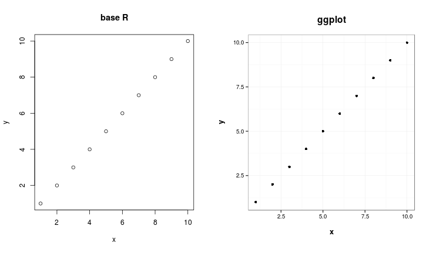

# Advanced Programming in R
#### Course given within the scope of the Marburg Research Academy (MARA) program on October 9, 2015 by Florian Detsch (florian.detsch@staff.uni-marburg.de) and Tim Appelhans (tim.appelhans@staff.uni-marburg.de).

<br>
The following R tutorial is not for beginners. This might seem odd at first 
since most tutorials tend to start with the very basics of the language, e.g. 


```r
1 + 1
```

```
## [1] 2
```

or, when it comes to using variables instead of calculator functionalities,  


```r
a <- 1
b <- 1

a + b
```

```
## [1] 2
```

Well, let's assume you are already familiar with such things. In fact, maybe it 
is because of the overwhelming number of R tutorials on the web that 
this particular tutorial starts a little later, after the first excitement has 
settled and one has grown familiar with the syntax and the basic commands.

That is all very well, but soon you will notice that you could use a little more 
of the stuff you heard R was capable of. There is, for instance, the saying that 
using `for` loops in R is not quite convenient - as opposed to other programming 
languages, including C++! So how is that, and what should I use as an 
alternative?

The same possibly applies for base graphics. Sure thing, everyone of us has been 
excited at some stage about the professional default style of R's artworks, not 
least because of the rather awkward MS Excel style that is still widely applied, 
amongst others, in the fields of academic research. Well, decide for yourselves 
which of the following figures is more appealing for you. 



It could also be conceivable that you came across a work step that requires 
massive computational power, and thus takes quite long to perform. R, by default, 
uses only one core on your machine, which could likely be the reason for the 
slow performance of your code. If you haven't heard, you can actually tell R to 
use multiple cores to reasonably split up slow peaces of code and make certain 
operations perform much fast. Today, most machines come with at least 4 internal 
cores which makes it easy to do such stuff.

You see, there's plenty of applications that definitely go beyond the scope of a 
base-R programmer's skills. In case you've felt a continuously rising interest 
while reading this short introduction, you might want to browse the following 
chapters of this tutorial on 'Advanced Programming in R' and see for yourselves.
