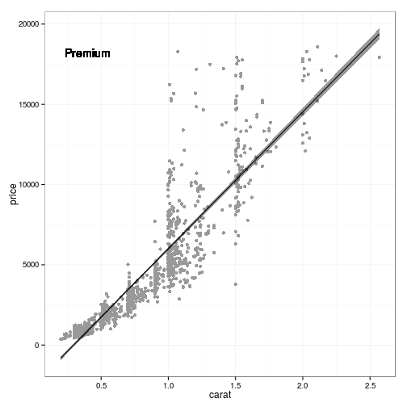

# The *\*apply* family

You may have heard of this family of functions and may have wondered what they are all about and how they differ from classic loop structures. 

In this cóurse we will familiarize ourselves with 

* `apply()`
* `lapply()` and `sapply()`

First of all, we need to recognize that these structures are pretty much unique to R. The reason for this is that R is at its very core a so-called _functional programming language_. This means nothing else than "every operation in R is carried out by an appropriate function". In fact, even the classical `<-` assignment operator is defined in the same way as any other function in R.


```r
> a <- 3
> a
```

```
[1] 3
```

```r
> "<-"(b, 15)
> b
```

```
[1] 15
```

```r
> "+"(a, b)
```

```
[1] 18
```

You may wonder why this is relevant to understand `*apply`? 

The one thing that all `*apply` functions have in common is that they are all so-called functionals that can take a function as an argument. Usually, these functionals take some object and some function as input and then apply the function to every entry of the object. The difference between the various `*apply` functions is basically the type of object they are designed for and hence each of these has slightly different requirements for the structure of the supplied function.

-------

### apply()

First, let's have a look at `apply()`. It has three main arguments

* `X` a matrix (or array) - or a 'clean' data frame that can be coerced to a mtraix, i.e. no mixture of classes in the columns (see example below)
* `MARGIN` an integer specifying whether to apply the supplied function to the rows (1) or the columns (2)
* `FUN` the function to be applied

Other function related arguments such as `na.rm = ...` can also be supplied.

Let's try this


```r
> data(diamonds)
> 
> ## subset diamonds to only numerical columns
> diamonds_num <- diamonds[, -c(2:4)]
> 
> ## apply function mean to all columns of diamonds
> col_means <- apply(diamonds_num, 2, mean, na.rm = TRUE)
> col_means
```

```
       carat        depth        table        price            x 
   0.7979397   61.7494049   57.4571839 3932.7997219    5.7311572 
           y            z 
   5.7345260    3.5387338 
```


### Task #1: apply sd to rows
Similar to the example above, calculate the standard deviation for each row of diamonds.

<center>
  
</center>


In R, `apply()` is the classical function to be used with data in matrix-like form to quickly iterate over one dimension (rows or columns). It is optimized for this kind of action and is much quicker than looping over rows/columns with a `for`-loop which is the satndard way in other languages such as Pyhton or C++.

-------

### lapply()

More powerful than `apply()` is `lapply()`. The 'l' stands for list and simply means that whatever is returned from an iterative process will be stored in a list. In R, lists are the most flexible way of storing things but their structure may need a little getting used to. Basically, you can store any combination of objects in lists. Matrices, for example, are much less versatile.

Let's have a look at what these lists look like:


```r
> lst <- list(1:10, 
+             "Hello", 
+             mean,
+             mean(1:10),
+             function(x) x + 1, 
+             data.frame(col1 = rnorm(10), col2 = runif(10)),
+             matrix(1:9, 3, 3))
> 
> lst
```

```
[[1]]
 [1]  1  2  3  4  5  6  7  8  9 10

[[2]]
[1] "Hello"

[[3]]
function (x, ...) 
UseMethod("mean")
<bytecode: 0x6607180>
<environment: namespace:base>

[[4]]
[1] 5.5

[[5]]
function (x) 
x + 1
<environment: 0x55fd768>

[[6]]
          col1      col2
1  -0.66920235 0.9371027
2   0.61228094 0.2879396
3  -0.95510649 0.6385464
4   0.90511608 0.6641325
5  -0.24258167 0.2516978
6  -0.06707924 0.3756470
7   1.52348955 0.7311695
8  -0.37881577 0.5293244
9   1.74211431 0.2957370
10 -0.71419336 0.5645180

[[7]]
     [,1] [,2] [,3]
[1,]    1    4    7
[2,]    2    5    8
[3,]    3    6    9
```

As you can see we can combine any odd type of objects. Note how each list entry is numbered. We could have supplied names as well, but it is less common to do so if your list is the result of an interative procedure. And accessing lists via their numbered entries is quite straight forward, yet a little different from the classical `$` notation of data frames. To 'navigate' to one of the entries we need to use double square brackets `[[x]]`. This is important as this will be the notion we need to keep in mind when iteration over lists.

`lapply()` can basically be used just like a `for`-loop, though the semntics are a little different. The two main differences are 

1. we can store the whole result of the `lapply()` call in an object (a list)
2. we need to write the bit that does the calculation part as a function 

So, if we were to recreate the first example from the previous chapter on `for`-loops


```r
> result <- lapply(1:5, function(i) i)
> result
```

```
[[1]]
[1] 1

[[2]]
[1] 2

[[3]]
[1] 3

[[4]]
[1] 4

[[5]]
[1] 5
```

The only time we will use `sapply()` in his tutorial is right here. `sapply()` and `lapply()` are very similar, so that it is sufficient to cover only one in detail. The 's' stands for 'simplify' which means that `sapply()` will try to return and object of simple structure, such as a vector or a matrix. 

Let's repeat the above with `sapply()`


```r
> result <- sapply(1:5, function(i) i)
> result
```

```
[1] 1 2 3 4 5
```

Getting a vector as a result is great if the calculation produces a vector, however this won't work if the result is e.g. a function or a `ggplot2`-object or something along those lines. Therefore, `lapply()` is simply the more versatile of the two as it can handle any type of result. 

To highlight this, let's use `lapply()` to read in the numerous chunks of data we have previously saved.


```r
> fls <- list.files("results", pattern = glob2rx("*subset*.csv"),
+                   full.names = TRUE)
> 
> dat_lst <- lapply(seq(fls), function(i) {
+   read.csv(fls[i])
+ })
> 
> str(dat_lst, 1)
```

```
List of 27
 $ :'data.frame':	2000 obs. of  10 variables:
 $ :'data.frame':	2000 obs. of  10 variables:
 $ :'data.frame':	2000 obs. of  10 variables:
 $ :'data.frame':	2000 obs. of  10 variables:
 $ :'data.frame':	2000 obs. of  10 variables:
 $ :'data.frame':	2000 obs. of  10 variables:
 $ :'data.frame':	2000 obs. of  10 variables:
 $ :'data.frame':	2000 obs. of  10 variables:
 $ :'data.frame':	2000 obs. of  10 variables:
 $ :'data.frame':	2000 obs. of  10 variables:
 $ :'data.frame':	2000 obs. of  10 variables:
 $ :'data.frame':	2000 obs. of  10 variables:
 $ :'data.frame':	2000 obs. of  10 variables:
 $ :'data.frame':	2000 obs. of  10 variables:
 $ :'data.frame':	2000 obs. of  10 variables:
 $ :'data.frame':	2000 obs. of  10 variables:
 $ :'data.frame':	2000 obs. of  10 variables:
 $ :'data.frame':	2000 obs. of  10 variables:
 $ :'data.frame':	2000 obs. of  10 variables:
 $ :'data.frame':	2000 obs. of  10 variables:
 $ :'data.frame':	2000 obs. of  10 variables:
 $ :'data.frame':	2000 obs. of  10 variables:
 $ :'data.frame':	2000 obs. of  10 variables:
 $ :'data.frame':	2000 obs. of  10 variables:
 $ :'data.frame':	2000 obs. of  10 variables:
 $ :'data.frame':	2000 obs. of  10 variables:
 $ :'data.frame':	1940 obs. of  10 variables:
```

Great, you might say, but now we have a list of multiple data frames instead of one complete data frame. In our case this seems rather silly, but think about situations where you want to analyse the same sort of data only from different dates or from different locations or patients or ...

Also, recombining these individual data frames back into one is tsraight forward. 


```r
> diamonds_df <- do.call("rbind", dat_lst)
> str(diamonds_df)
```

```
'data.frame':	53940 obs. of  10 variables:
 $ carat  : num  0.23 0.21 0.23 0.29 0.31 0.24 0.24 0.26 0.22 0.23 ...
 $ cut    : Factor w/ 5 levels "Fair","Good",..: 3 4 2 4 2 5 5 5 1 5 ...
 $ color  : Factor w/ 7 levels "D","E","F","G",..: 2 2 2 6 7 7 6 5 2 5 ...
 $ clarity: Factor w/ 8 levels "I1","IF","SI1",..: 4 3 5 6 4 8 7 3 6 5 ...
 $ depth  : num  61.5 59.8 56.9 62.4 63.3 62.8 62.3 61.9 65.1 59.4 ...
 $ table  : num  55 61 65 58 58 57 57 55 61 61 ...
 $ price  : int  326 326 327 334 335 336 336 337 337 338 ...
 $ x      : num  3.95 3.89 4.05 4.2 4.34 3.94 3.95 4.07 3.87 4 ...
 $ y      : num  3.98 3.84 4.07 4.23 4.35 3.96 3.98 4.11 3.78 4.05 ...
 $ z      : num  2.43 2.31 2.31 2.63 2.75 2.48 2.47 2.53 2.49 2.39 ...
```

Fianlly, let's look at a slightly more involved example of how to use `lapply()`. A standard analysis workflow likely involves some sort of statistical analysis + the visualisation of the results in some way. Here, we will create linear models between 'carat' and 'price' and the corresponding scatterplots for all levels of 'cut' but only for those diamonds of 'color = D'.


```r
> ## split diamonds by cut
> cut_lst <- split(diamonds, f = diamonds$cut)
> 
> my_result_list <- lapply(seq(cut_lst), function(i) {
+   
+   ## subset to color = D
+   dat <- cut_lst[[i]]
+   dat_d <- subset(dat, dat$color == "D")
+   
+   ## calculate linear model
+   lm1 <- lm(price ~ carat, data = dat_d)
+   
+   ## create scatterplot
+   scatter_ggplot <- ggplot(aes(x = carat, y = price), data = dat_d)
+   g_sc <- scatter_ggplot + 
+     geom_point(colour = "grey60") +
+     theme_bw() +
+     stat_smooth(method = "lm", se = TRUE, 
+                 fill = "black", colour = "black") +
+      geom_text(data = NULL, 
+                x = min(dat_d$carat, na.rm = TRUE) + 0.2,  
+                y = max(dat_d$price, na.rm = TRUE) * 0.98, 
+                label = unique(dat_d$cut))
+   
+   ## return both the linear model and the plot as a list
+   return(list(linmod = lm1,
+               plt = g_sc))
+ })
> 
> ## set names of list for clarity
> names(my_result_list) <- names(cut_lst)
> 
> str(my_result_list, 2)
```

```
List of 5
 $ Fair     :List of 2
  ..$ linmod:List of 12
  .. ..- attr(*, "class")= chr "lm"
  ..$ plt   :List of 9
  .. ..- attr(*, "class")= chr [1:2] "gg" "ggplot"
 $ Good     :List of 2
  ..$ linmod:List of 12
  .. ..- attr(*, "class")= chr "lm"
  ..$ plt   :List of 9
  .. ..- attr(*, "class")= chr [1:2] "gg" "ggplot"
 $ Very Good:List of 2
  ..$ linmod:List of 12
  .. ..- attr(*, "class")= chr "lm"
  ..$ plt   :List of 9
  .. ..- attr(*, "class")= chr [1:2] "gg" "ggplot"
 $ Premium  :List of 2
  ..$ linmod:List of 12
  .. ..- attr(*, "class")= chr "lm"
  ..$ plt   :List of 9
  .. ..- attr(*, "class")= chr [1:2] "gg" "ggplot"
 $ Ideal    :List of 2
  ..$ linmod:List of 12
  .. ..- attr(*, "class")= chr "lm"
  ..$ plt   :List of 9
  .. ..- attr(*, "class")= chr [1:2] "gg" "ggplot"
```

This let's us now quickly access each of the analyses individually. To view the scatterplot for diamonds of 'cut = Premium' we simply navigate down to the respective entry (Note, given that we have set the names for the resulting lists we can now use the common `$` notation for the navigation):


```r
> my_result_list$Premium$plt
```

 

We can, hovever still navigate using `[[]]`. To get the summary of the linear model for 'cut = Ideal':


```r
> summary(my_result_list[[5]][[1]])
```

```

Call:
lm(formula = price ~ carat, data = dat_d)

Residuals:
    Min      1Q  Median      3Q     Max 
-9239.6  -611.1   -38.9   419.5 10759.7 

Coefficients:
            Estimate Std. Error t value Pr(>|t|)    
(Intercept) -2490.89      51.89  -48.01   <2e-16 ***
carat        9049.65      81.06  111.64   <2e-16 ***
---
Signif. codes:  0 '***' 0.001 '**' 0.01 '*' 0.05 '.' 0.1 ' ' 1

Residual standard error: 1292 on 2832 degrees of freedom
Multiple R-squared:  0.8148,	Adjusted R-squared:  0.8148 
F-statistic: 1.246e+04 on 1 and 2832 DF,  p-value: < 2.2e-16
```

I hope this highlights how useful and flexible `lapply()` can be. Another scenario that is quite common is to carry out different calculations/computations on the same set of data. This can easily be done using `lapply()` by iterating over the different functions and calling them on the same data set within the `lapply()` loop.
